# UK Road Accidents Analysis Dashboard

## Project Overview
This project analyzes UK road accident data and presents the results in an interactive dashboard using Python and Streamlit.

The goal is to understand accident patterns based on severity, year, weather conditions, road surface, lighting, speed limit, driver age, and vehicle-related factors.

---

## Dataset
The project uses the UK Road Safety dataset, which contains information about road accidents and involved vehicles.

Main files used:
- `merged_road_safety_data.csv`
- `accidents_clean.csv`

---

## Tools and Libraries
- Python
- Pandas
- Plotly
- Streamlit
- Google Colab
- VS Code
- GitHub

---

## Project Features
- Data cleaning and preprocessing
- Accident trend analysis by year
- Accident severity analysis
- Weather conditions analysis
- Road surface conditions analysis
- Light conditions analysis
- Speed limit and severity analysis
- Driver age band analysis
- Vehicle manoeuvre analysis
- Interactive filters
- Heatmap by day of week and hour

---

## How to Run the Project

1. Install the required libraries:

```bash
pip install -r requirements.txt
```

2. Run the Streamlit app:

```bash
streamlit run app.py
```

3. Open the local URL shown in the terminal.

---

## Dashboard Screenshots

### Main Dashboard
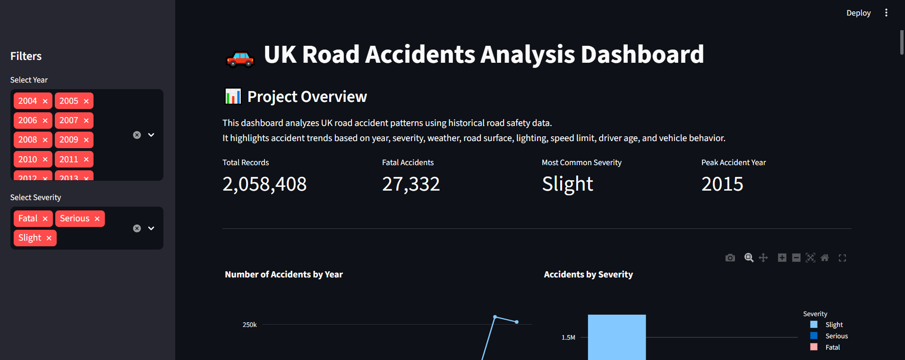

### Top Weather Conditions
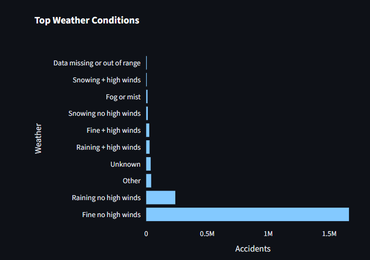

### Road Surface Conditions
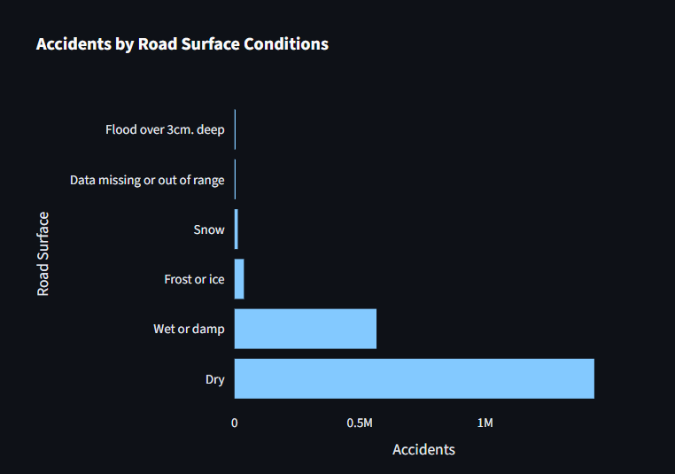

### Light Conditions
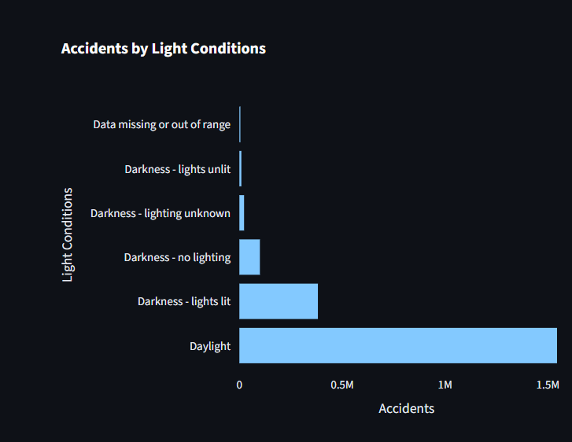

### Accident Severity by Speed Limit
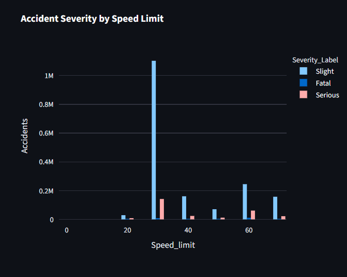

### Heatmap by Day of Week and Hour
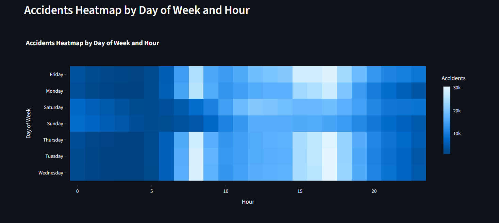

### Urban vs Rural Conditions
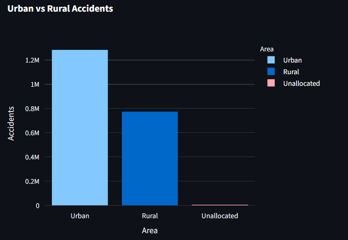

### Driver Age Band
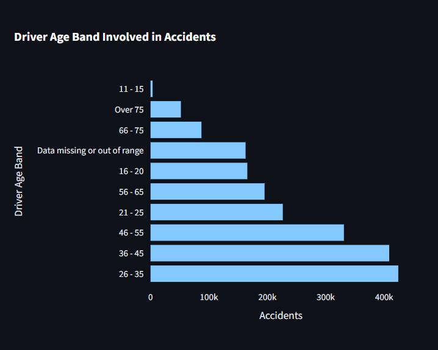

### Top Vehicles Involved in Accidents
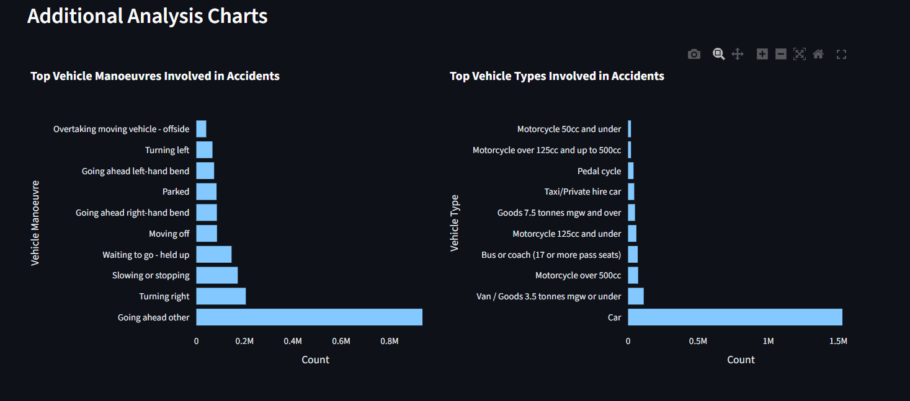

### Accidents by Sex of Driver
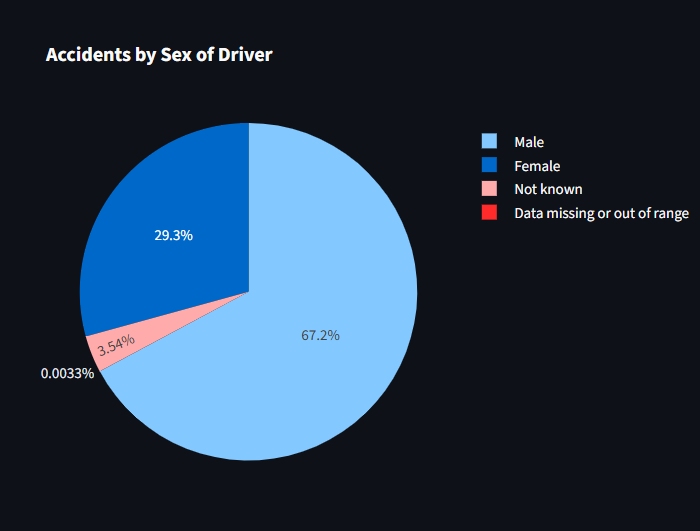

### Overtaking Cases
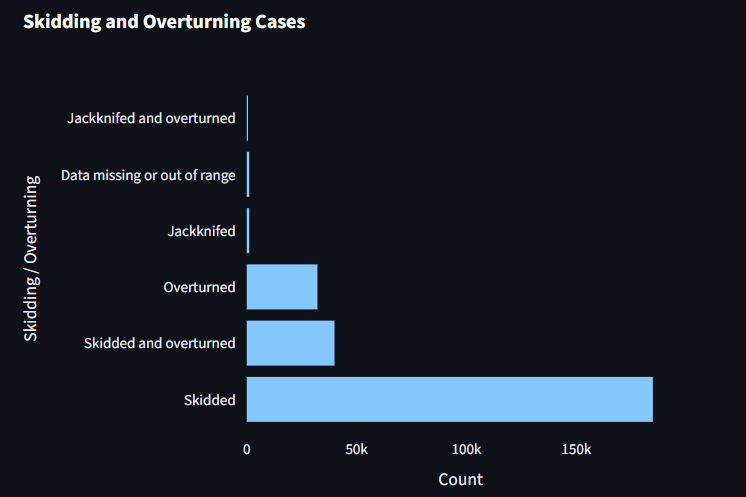

### Top Accident Locations
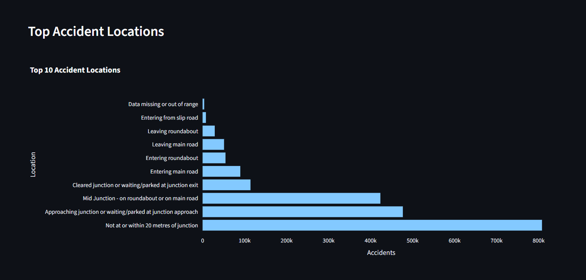

---

## Key Insights
- Most accident records are classified as slight accidents.
- Urban areas show higher accident counts than rural areas.
- Dry road surfaces have the highest number of accidents because they are the most common road condition.
- Lighting, weather, speed limit, driver age, and vehicle manoeuvres help explain accident patterns.
- The heatmap shows how accidents vary by day of week and hour.

---

## Team Members and Contributions

| Member         | Contribution |

| Yousef         | Dataset collection and source documentation |
| Amr            | Data loading and initial data exploration |
| Mariem         | Data cleaning and handling missing values |
| Karim          | Merging accident and vehicle datasets |
| Abdelrahman    | Year, severity, weather, and road surface analysis |
| Doha           | Driver age, vehicle type, and vehicle manoeuvre analysis |
| Noor           | Visualization charts and heatmap preparation |
| Nouran         | Streamlit dashboard development and interactive filters |
| Jana           | README, GitHub repository, screenshots, and presentation |

---

## Project Structure

```text
Road_Accidents_Project/
│
├── app.py
├── merged_road_safety_data.csv
├── accidents_clean.csv
├── requirements.txt
├── README.md
├── screenshots/
│   ├── dashboard.png
│   ├── top_weather_conditions.png
│   ├── accidents_by_road_surface_conditions.png
│   ├── accidents_by_lights_conditions.png
│   ├── accidents_severity_by_speed_limit.png
│   ├── accidents_heatmap_by_day_of_week_and_hour.png
│   ├── urban_vs_rular_conditions.png
│   ├── driver_age_band_involved_in_accidents.png
│   ├── top_vehicles_involved_in_accidents.png
│   ├── accidents_by_sex_driver.png
│   ├── overtaking_cases.png
│   └── top_accidents_locations.png
└── notebooks/
    └── Display_Project.ipynb
```

---

## Conclusion
This project demonstrates how data analysis and visualization can be used to explore road accident patterns and support better understanding of road safety factors.
